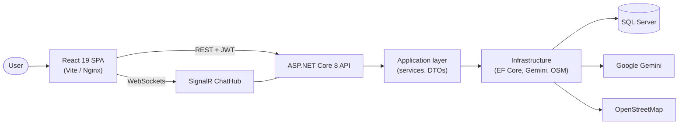

<h1 align="center">Local Destination Finder (LDF)</h1>

<p align="center">
  A full-stack smart tourism platform for exploring Saudi Arabia's 13 administrative regions —
  discover destinations, compare travel packages, request quotes, book and pay, and chat with travel offices in real time.
</p>

<p align="center">
  
  
  
  
  
  
</p>

---

## Screenshots

<!-- Add screenshots to docs/screenshots/ and reference them here, e.g.:


-->

---

## Features

**For travelers**
- 🗺️ **Explore by region and city** — all 13 regions of Saudi Arabia with destinations, hotels, restaurants, cafés, events and activities.
- 📍 **Interactive maps** — Leaflet maps with nearby places powered by OpenStreetMap (Nominatim / Overpass).
- 🔎 **Unified search** with Arabic text normalization.
- 🤖 **AI trip planner** — itinerary suggestions powered by Google Gemini.
- ⭐ **Personalized recommendations**, reviews and wishlists organized in folders.
- 📦 **Packages & comparison** — compare packages side by side or request a custom package.
- 💬 **Quotes and live chat** — request quotes from travel offices and negotiate over real-time chat (SignalR).
- 💳 **Bookings, checkout and payments** with idempotent payment handling.
- 🔔 **Notifications center** for bookings, offers and messages.

**For travel offices and admins**
- 🏢 **Office dashboard** to manage packages, quote proposals and bookings.
- 🛡️ **Admin CMS and moderation** for places, reviews and content.
- 📜 **Audit logging** of sensitive operations.

**Engineering highlights**
- Clean Architecture backend (`Core` → `Application` → `Infrastructure` → `Api`).
- ASP.NET Identity + JWT with refresh tokens and role-based authorization (user, guide, office, provider, admin).
- Rate limiting, global exception handling, security headers and health checks.
- EF Core migrations with seeding; in-memory database for quick local development.
- Unit and integration tests (xUnit).
- Fully containerized with Docker Compose (SQL Server + API + Nginx-served frontend).

---

## Tech Stack

| Layer | Technologies |
|---|---|
| **Frontend** | React 19, TypeScript, Vite, Tailwind CSS, React Router, Leaflet, Motion, `@microsoft/signalr` |
| **Backend** | ASP.NET Core 8 Web API, ASP.NET Identity, JWT, SignalR, EF Core 8, Swagger |
| **Database** | SQL Server 2022 (production) · EF Core InMemory (development) |
| **AI & Maps** | Google Gemini API · OpenStreetMap (Nominatim, Overpass) |
| **DevOps** | Docker, Docker Compose, Nginx · deployment plan for Google Cloud (see [`docs/deployment.md`](docs/deployment.md)) |

---

## Architecture



---

## Project Structure

```text
local-destination-finder/
├── backend/
│   ├── Ldf.Core/               # Entities, domain constants, interfaces
│   ├── Ldf.Application/        # Services, DTOs, business logic
│   ├── Ldf.Infrastructure/     # EF Core DbContext, migrations, seeder, Gemini & OSM services, SignalR hub
│   ├── Ldf.Api/                # Controllers, middleware, Program.cs
│   ├── Ldf.UnitTests/          # xUnit unit tests
│   ├── Ldf.IntegrationTests/   # xUnit integration tests
│   └── Dockerfile
├── src/
│   ├── api/                    # Typed API clients
│   ├── components/             # Shared UI components
│   ├── pages/                  # Application pages
│   ├── realtime/               # SignalR client
│   └── types/                  # Shared TypeScript models
├── docs/deployment.md          # Cloud deployment strategy
├── docker-compose.yml          # SQL Server + API + frontend
├── Dockerfile                  # Frontend build (Nginx)
└── .env.example                # Environment variable template
```

---

## Getting Started

### Prerequisites
- [.NET 8 SDK](https://dotnet.microsoft.com/download)
- [Node.js 20+](https://nodejs.org/)
- [Docker](https://www.docker.com/) (optional, for the full stack)

### Configuration

Copy the template and fill in your own values — **never commit real secrets**:

```bash
cp .env.example .env
```

| Variable | Purpose |
|---|---|
| `ConnectionStrings__DefaultConnection` | SQL Server connection string |
| `Jwt__Key` | JWT signing key (32+ characters) |
| `Gemini__ApiKey` | Google Gemini API key for the AI planner |

For local .NET development you can also use [User Secrets](https://learn.microsoft.com/aspnet/core/security/app-secrets):

```bash
cd backend/Ldf.Api
dotnet user-secrets set "Jwt:Key" "<your-secret-key>"
dotnet user-secrets set "Gemini:ApiKey" "<your-gemini-key>"
```

### Option 1 — Run locally

```bash
# 1. Backend (uses the in-memory database in Development)
cd backend/Ldf.Api
dotnet run              # http://localhost:5205  (Swagger: /swagger)

# 2. Frontend (new terminal, from the repo root)
npm install
npm run dev             # http://localhost:3000
```

### Option 2 — Docker Compose (full stack with SQL Server)

```bash
docker compose up --build
```

| Service | URL |
|---|---|
| Frontend | http://localhost:8088 |
| API | http://localhost:5205 |
| SQL Server | localhost:1433 |

### Running tests

```bash
cd backend
dotnet test
```

---

## Deployment

See [`docs/deployment.md`](docs/deployment.md) for the recommended Google Cloud setup (Cloud Run, Cloud SQL, Secret Manager) and the production security checklist.

---

## Author

**Ali Alqahtani** — [GitHub](https://github.com/lq-p3) · [LinkedIn](https://www.linkedin.com/in/ali-alqahtani-2a8297333)

## License

This project is licensed under the [MIT License](LICENSE).

Map data © [OpenStreetMap](https://www.openstreetmap.org/copyright) contributors.
